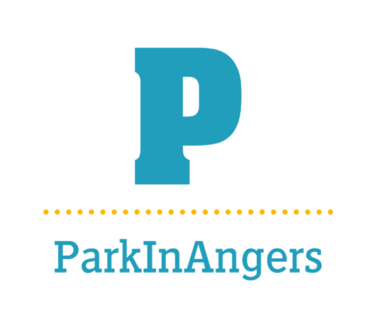

# ParkInAngers

(image sur application Android pour lancer l'application)

## version de Flutter/Dart utilisée

Version de Dart : 3.1.5

Version de Flutter : 3.13.9

## fonctionnalités de l’application

L'objectif de notre application est de permettre à un utilisateur de localiser un parking à Angers autour de lui, et de connaître le nombre de places disponibles dans ce parking.

Notre application est basée sur un menu à trois boutons, le premier renvoie sur la page de garde, la carte. Le second affiche les parkings enregistrés comme favoris. Enfin, le troisième affiche la liste de tous les parkings d'Angers.

Lorsque l'utilisateur lance l'application, il voit la carte s'afficher, il est ensuite géolocalisé et placé sur la carte. La map indique les différents parking de la ville d'Angers.

En cliquant sur les marqueurs rouges, celui sélectionné passe en bleu et les informations principales du parking choisi s'affichent dans un menu que doit dérouler vers le haut l'utilisateur.

Dans la page des favoris, l'utilisateur peut voir ses parkings préférés, pour des problèmes de rafraîchissement, un bouton pour actualiser a été ajouté.

Sur la dernière page est visible la liste de tous les parkings d'Angers. Ces parkings sont ordonnés selon la distance qui nous sépare du parking (les plus proches en haut), s'il n'y a pas de problème de localisation.

Il est également possible en appuyant sur le bouton filtrer en haut à droite, de cocher les checkbox pour ne voir que les parkings où il reste de la place, ceux encore ouvert et ceux gratuit pendant une heure.

Lorsque l'on clique sur un parking dans la liste, il est possible de visualiser les informations de ce dernier et également de l'ajouter au favoris en cliquant sur le bouton favori (cœur).
Une fois ce processus effectué, si l'utilisateur retourne sur la page des favoris, il verra le ou les parkings choisis affichés.

## API utilisées

Deux API ont été utilisées dans ce projet : 

- Disponibilité dans les Parkings à Angers : https://data.angers.fr/explore/dataset/parking-angers/information/
- Angers stationnement : https://data.angers.fr/explore/dataset/angers_stationnement/information/

Les deux API sont complémentaires, la première affiche le nom du parking et le nombre de places disponibles alors que la deuxième met à disposition des données complémentaires, comme la localisation, le nombre de places total, les tarfis, les horaires ...
